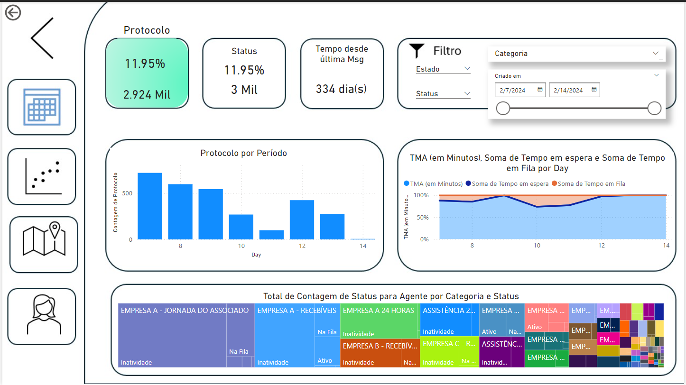
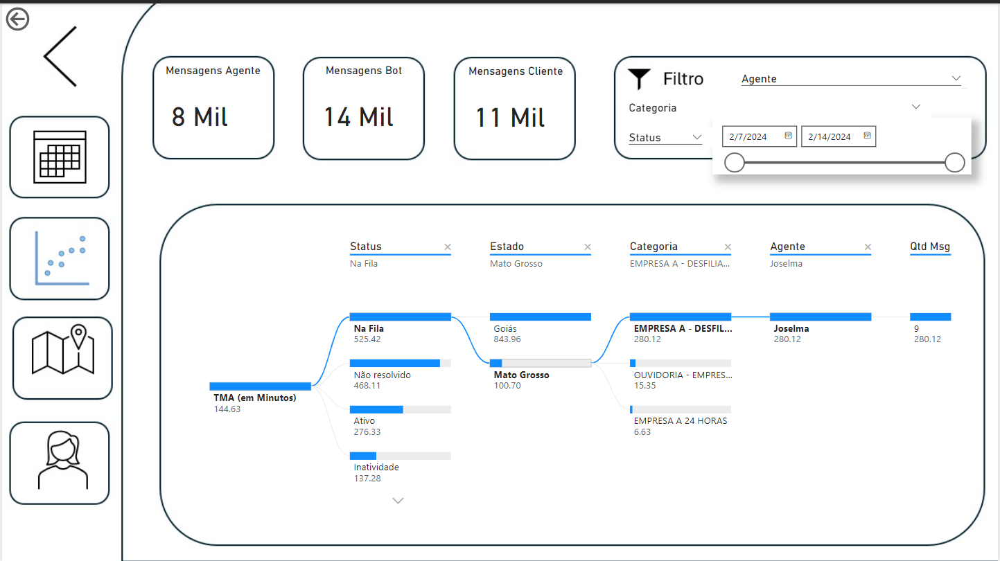
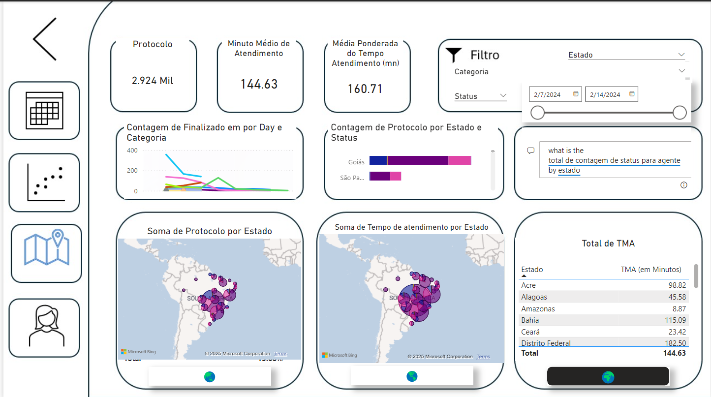
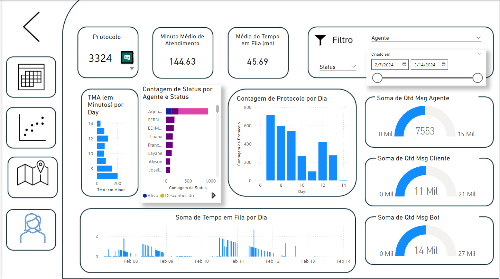

# Análise de desempenho para atendimento ao cliente - Demonstração do Power BI

Bem-vindo à demonstração do **Análise de desempenho para atendimento ao cliente**! 
Este aplicativo do Power BI foi projetado para fornecer insights aprofundados sobre métricas de desempenho do atendimento ao cliente, permitindo melhor tomada de decisão e eficiência operacional.

## Visão geral
Este aplicativo do Power BI oferece painéis dinâmicos para monitorar, analisar e otimizar indicadores-chave de desempenho (KPIs) relacionados ao atendimento ao cliente. 
Com seu design intuitivo e análises robustas, esta demonstração serve como um modelo para analisar e aprimorar o desempenho do atendimento ao cliente em todos os setores.


# DAX para Pré Processamento de Dados
```js
let
    // tecnicas usadas: DRY
    // Fonte de dados
    Source = Excel.Workbook(File.Contents("C:\Users\eu\Downloads\Teste Analista Novo.xlsx"), null, true),
    Sheet1_Sheet = Source{[Item="Sheet1",Kind="Sheet"]}[Data],
    #"Promoted Headers" = Table.PromoteHeaders(Sheet1_Sheet, [PromoteAllScalars=true]),

    // Função para corrigir o formato de duração considerando dias assumindo [formatação constante em hh:mm:ss]
    CorrigirDuracao = (duracao as text) as nullable duration =>
        let
            Partes = Text.Split(duracao, ":"),
            Resultado = 
                if List.Count(Partes) = 3 then
                    let
                        HorasTotais = Number.FromText(Partes{0}),
                        Minutos = Number.FromText(Partes{1}),
                        Segundos = Number.FromText(Partes{2}),
                        Dias = Number.IntegerDivide(HorasTotais, 24),
                        Horas = Number.Mod(HorasTotais, 24)
                    in
                        #duration(Dias, Horas, Minutos, Segundos)
                else
                    null
        in
            Resultado,

    // Função para corrigir o formato de telefone para "CC(DDD)9xxxx-xxxx"
    FormatarTelefone = (telefone as nullable text) as nullable text =>
        let
            // Validar se o telefone é nulo ou vazio
            telefoneValido = if telefone = null or telefone = "" then null else telefone,

            // Remover caracteres não numéricos iniciais (como +, -)
            telefoneLimpo = Text.Remove(Text.Trim(telefoneValido), {"-", "+", "."}),

            // Extração do Código do País (CC)
            // Localiza o primeiro caractere que não é um número ou um delimitador
            CCPosicaoFim = Text.PositionOfAny(telefoneLimpo, {"(", " "}),
            CodigoPais = if CCPosicaoFim > 0 then Text.Start(telefoneLimpo, CCPosicaoFim) else null,

            // Remover o CC da string
            TelefoneSemCC = if CodigoPais <> null then Text.RemoveRange(telefoneLimpo, 0, CCPosicaoFim) else telefoneLimpo,

            // Extração do DDD
            // Localiza parênteses ou assume os primeiros espaços
            DDDInicio = Text.PositionOf(TelefoneSemCC, "("),
            DDDPosicaoFim = Text.PositionOf(TelefoneSemCC, ")"),
            DDD = 
                if DDDInicio >= 0 and DDDPosicaoFim > DDDInicio then 
                    Text.Middle(TelefoneSemCC, DDDInicio + 1, DDDPosicaoFim - DDDInicio - 1)
                else 
                    Text.Start(TelefoneSemCC, 2),

            // Número de telefone (sem CC e DDD)
            NumeroInicio = if DDDPosicaoFim > 0 then DDDPosicaoFim + 1 else 2,
            NumeroTelefone = Text.RemoveRange(TelefoneSemCC, 0, NumeroInicio),

            // Adicionar o dígito 9 ao número se ele tiver apenas 8 dígitos
            NumeroCorrigido = if Text.Length(NumeroTelefone) = 8 then "9" & NumeroTelefone else NumeroTelefone,

            // Formatar número em blocos de 4
            NumeroFormatado = Text.Middle(NumeroCorrigido, 0, 5) & "-" & Text.End(NumeroCorrigido, 4),

            // Reconstruir o telefone no formato desejado
            TelefoneFormatado = CodigoPais & "(" & DDD & ")" & NumeroFormatado
        in
            TelefoneFormatado,


    // Função para obter o estado com base no DDD
    ObterEstadoPorDDD = (ddd as text) as text =>
        let

            dddValido = if ddd <> null and Text.Length(ddd) = 2 then ddd else "Estado Outros",
            Mapeamento = [
                #"11" = "São Paulo",
                #"12" = "São Paulo",
                #"13" = "São Paulo",
                #"14" = "São Paulo",
                #"15" = "São Paulo",
                #"16" = "São Paulo",
                #"17" = "São Paulo",
                #"18" = "São Paulo",
                #"19" = "São Paulo",
                #"21" = "Rio de Janeiro",
                #"22" = "Rio de Janeiro",
                #"24" = "Rio de Janeiro",
                #"27" = "Espírito Santo",
                #"28" = "Espírito Santo",
                #"31" = "Minas Gerais",
                #"32" = "Minas Gerais",
                #"33" = "Minas Gerais",
                #"34" = "Minas Gerais",
                #"35" = "Minas Gerais",
                #"37" = "Minas Gerais",
                #"38" = "Minas Gerais",
                #"41" = "Paraná",
                #"42" = "Paraná",
                #"43" = "Paraná",
                #"44" = "Paraná",
                #"45" = "Paraná",
                #"46" = "Paraná",
                #"47" = "Santa Catarina",
                #"48" = "Santa Catarina",
                #"49" = "Santa Catarina",
                #"51" = "Rio Grande do Sul",
                #"53" = "Rio Grande do Sul",
                #"54" = "Rio Grande do Sul",
                #"55" = "Rio Grande do Sul",
                #"61" = "Distrito Federal",
                #"62" = "Goiás",
                #"63" = "Tocantins",
                #"64" = "Goiás",
                #"65" = "Mato Grosso",
                #"66" = "Mato Grosso",
                #"67" = "Mato Grosso do Sul",
                #"68" = "Acre",
                #"69" = "Rondônia",
                #"71" = "Bahia",
                #"73" = "Bahia",
                #"74" = "Bahia",
                #"75" = "Bahia",
                #"77" = "Bahia",
                #"79" = "Sergipe",
                #"81" = "Pernambuco",
                #"82" = "Alagoas",
                #"83" = "Paraíba",
                #"84" = "Rio Grande do Norte",
                #"85" = "Ceará",
                #"86" = "Piauí",
                #"87" = "Pernambuco",
                #"88" = "Ceará",
                #"89" = "Piauí",
                #"91" = "Pará",
                #"92" = "Amazonas",
                #"93" = "Pará",
                #"94" = "Pará",
                #"95" = "Roraima",
                #"96" = "Amapá",
                #"97" = "Amazonas",
                #"98" = "Maranhão",
                #"99" = "Maranhão"
            ],
            // Retornar o estado correspondente ao DDD ou "Estado Outros" caso não exista mapeamento
            Estado = if dddValido <> null then Record.FieldOrDefault(Mapeamento, dddValido, "Estado Outros") else "Estado Outros"
        in
            Estado,

    // Aplicar correção nas colunas de duração
    ColunasDuracao = {"Tempo em Fila", "Tempo de atendimento", "Tempo de atendimento Humano", "Tempo em espera"},
    TratamentoDuracoes = Table.TransformColumns(
        #"Promoted Headers",
        List.Transform(ColunasDuracao, each {_, each if Text.Contains(_, ":") then CorrigirDuracao(_) else null, type duration})
    ),

    // Tratamento inicial de valores inconsistentes
    TratamentoInicial = Table.TransformColumns(
        TratamentoDuracoes,
        {
            {"Última Msg Cliente", each if _ = "Em atendimento" or _ = "-" then null else _},
            {"Última Msg Agente", each if _ = "Em atendimento" or _ = "-" then null else _},
            {"Finalizado em", each if _ = "Em atendimento" or _ = "-" then null else _},
            {"Transferido em", each if _ = "Em atendimento" or _ = "-" then null else _},
            {"Criado em", each if _ = "Em atendimento" or _ = "-" then null else _},
            {"Agente", each if _ = "-" or _ = null then "Agente Secreto" else _},
            {"Status", each if _ = "-" or _ = null then "Desconhecido" else _},
            {"Qtd Msg Bot", each if _ = null or _ = "-" then 0 else _},
            {"Qtd Msg Cliente", each if _ = null or _ = "-" then 0 else _},
            {"Qtd Msg Agente", each if _ = null or _ = "-" then 0 else _}
        }
    ),

    // Formatar a coluna Telefone
    TratamentoTelefone = Table.TransformColumns(
        TratamentoInicial,
        {{"Telefone", each if _ = null then null else FormatarTelefone(Text.From(_)), type text}}
    ),

    // Adicionar coluna de Estado com base no DDD
    // Adicionar coluna de Estado com base no DDD
    AdicionarEstado = Table.AddColumn(
        TratamentoTelefone,
        "Estado",
        each if [Telefone] = null then "Estado Outros" else ObterEstadoPorDDD(Text.Middle([Telefone], 3, 2)),
        type text
    ),

    // Tipagem correta após o tratamento
    #"Changed Type" = Table.TransformColumnTypes(AdicionarEstado, {
        {"Protocolo", Int64.Type},
        {"Categoria", type text},
        {"Telefone", type nullable text},
        {"Agente", type text},
        {"Status", type text},
        {"Criado em", type datetime},
        {"Transferido em", type datetime},
        {"Finalizado em", type datetime},
        {"Última Msg Cliente", type datetime},
        {"Última Msg Agente", type datetime},
        {"Qtd Msg Bot", Int64.Type},
        {"Qtd Msg Cliente", Int64.Type},
        {"Qtd Msg Agente", Int64.Type},
        {"Tempo em Fila", type duration},
        {"Tempo de atendimento", type duration},
        {"Tempo de atendimento Humano", type duration},
        {"Tempo em espera", type duration}
    }),
    #"Linhas Classificadas" = Table.Sort(#"Changed Type",{{"Última Msg Cliente", Order.Descending}, {"Protocolo", Order.Ascending}})
in
    #"Linhas Classificadas"
```

## Recursos

1. **Painel Geral**
- Visão geral abrangente das métricas de desempenho do atendimento ao cliente.
- Os principais pontos de dados incluem total de tickets, casos resolvidos, tempos médios de resposta.
- Resumos visuais como gráficos de barras, gráficos de linhas e cartões de KPI.
- 

2. **Painel de desempenho**
- Análise focada no desempenho do agente e da equipe.
- As métricas incluem tempos de resposta individuais, taxas de resolução e distribuição de carga de trabalho.
- Análise comparativa com benchmarks.
- 


3. **Painel de análise regional**
- Análise regional do desempenho do atendimento ao cliente.
- Mapas e gráficos para identificar áreas de alto e baixo desempenho.
- Insights sobre desafios e sucessos específicos da região.
- 

4. **Painel de insights profissionais**
- Recursos de detalhamento para desempenho profissional individual.
- Dados detalhados sobre qualidade de interação e eficiência.
- 

## Como usar
1. Abra o arquivo do Power BI e certifique-se de que todas as fontes de dados estejam conectadas corretamente.
2. Use filtros e segmentações para personalizar sua visualização dos dados.
3. Navegue entre os painéis para explorar áreas específicas de desempenho.
4. Identifique tendências, gargalos e oportunidades de melhoria.
5. Exporte visualizações ou relatórios para compartilhar com as partes interessadas.

## Benefícios
- Maior visibilidade das operações de atendimento ao cliente.
- Tomada de decisão baseada em dados para maior satisfação do cliente.
- Identificação de necessidades de treinamento e melhorias de processo.
- Escalabilidade para vários tamanhos e setores de negócios.

---
